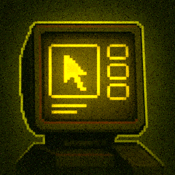



# InfoSkull
InfoSkull is a White Knuckle mod that aims to make UI more customizable.

> [!IMPORTANT]
> InfoSkull is leaderboard **LEGAL**, however certain configurations may
> void leaderboard legality. You will be notified in-game if your current
> configuration is not leaderboard legal.

## Getting Started
To get started with InfoSkull you have multiple options to choose from.

A more in-dept guide for using mods can be found on the [White Knuckle 
discord](https://discord.com/channels/1278757582038630410/1384190139059798016)

### Thunderstore Mod Manager (Recommended)
InfoSkull is available on [Thunderstore](https://thunderstore.io/c/white-knuckle/p/notTamion/InfoSkull/) 
for easy installation and updates.

### Manual Installation
To manually install InfoSkull you first need to download 
[BepInEx 5.x.x](https://docs.bepinex.dev/articles/user_guide/installation/index.html)

Afterward download InfoSkull from either the [Releases](https://github.com/notTamion/InfoSkull/releases)
or [Thunderstore](https://thunderstore.io/c/white-knuckle/p/notTamion/InfoSkull/)
and move the unpacked zip folder into the `BepInEx/plugins` folder

Now your file structure should look something like this
```
WhiteKnuckle
├── BepInEx
│   ├── plugins
│   │   ├── notTamion-InfoSkull-x.x.x (folder)
```

## General Usage
InfoSkull can be configured by entering the in-game pause menu and
pressing the `Adjust UI` button.

From here you can drag and drop UI elements to your liking.

To add e.g. add new elements or remove existing ones, hit the `alt` key
and navigate through the menu options.

## Built-ins
InfoSkull comes with a few built-in UI elements that can be used.

### Vanilla Elements
InfoSkull allows you to move around and optionally disable vanilla UI elements.

### TextDisplay
A simple text display that can be customized to show any text you want.

#### Placeholders
| Format              | Description                          | Leaderboard Legal |
|---------------------|--------------------------------------|-------------------|
| `{level}`           | Current level name                   | ✅                 |
| `{level_time}`      | Time spent in current level          | ✅                 |
| `{height}`          | Player vertical height               | ✅                 |
| `{best_level_time}` | Best time achieved for current level | ✅                 |
| `{ascent_rate}`     | Player ascent rate                   | ✅                 |
| `{game_time}`       | Total game time                      | ✅                 |
| `{clock}`           | System clock time                    | ✅                 |
| `{left_stamina}`    | Left hand stamina                    | ❌                 |
| `{right_stamina}`   | Right hand stamina                   | ❌                 |
| `{mass_height}`     | Mass floor height                    | ❌                 |
| `{mass_speed}`      | Mass floor speed                     | ❌                 |
| `{mass_acc_mult}`   | Mass speed increase multiplier       | ✅                 |
| `{mass_distance}`   | Player distance to mass              | ❌                 |
| `{score}`           | Your current run score               | ✅                 |
| `{high_score}`      | Previous run high score              | ✅                 |
| `{ascent}`          | Total ascent climbed                 | ✅                 |
| `{velocity}`        | Player velocity                      | ✅                 |
| `{health}`          | Player Health                        | ❌                 |
| `{extra_jumps}`     | Extra jumps remaining                | ❌                 |
| `{empty}`           | Empty output placeholder             | ✅                 |

To stylize the text display, you can use 
[TMPro rich text tags](https://docs.unity3d.com/Packages/com.unity.textmeshpro@4.0/manual/RichText.html).

## API 
Other mods can create custom InfoSkull UI elements by implementing them
in their own mod and registering them with InfoSkull. Exact documentation for
this is still pending, but you can look at the source code of the built-ins to get
a rough idea.

## Contributing
If you want to contribute to InfoSkull, feel free to open an issue or a pull request.

## Help
If you need help with InfoSkull, you can contact me on Discord. My handle is `tamion`.